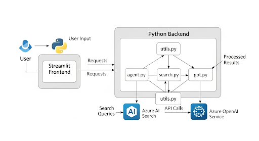

# 
<html>
<body>

[프로젝트명]
상품 개발 지원 Assistant
# 상품 개발 지원 Assistant

## 1: 프로젝트 개요

### 문제 정의
- 신규 상품 기획시, 유사 상품 비교 분석하는 과정의 어려움 존재  
- 거대한 기존 상품 데이터 속에서 의미 있는 정보 선별의 어려움 존재

### 대상 사용자
- 신규 상품 기획 및 개발 담당자, 마케팅 담당자 등 상품 개발과 관련된 모든 실무자

### 솔루션 개요
Azure OpenAI Service와 Azure AI Search를 활용하여 신규 상품명과 제휴 서비스를 입력하면,  
기존 유사 상품을 찾아 가격 및 장단점을 비교 분석해주는 '상품 개발 지원 Assistant'

## 2: 아키텍처 다이어그램

## 3: 핵심 기술 포인트
- RAG(Retrieval-Augmented Generation) 설계  
- Azure AI Search를 통해 상품 데이터 중에서 가장 관련성 높은 정보를 검색  
- 커스텀 프롬프트 엔지니어링  
- agent.py에서 신규 상품명, 제휴 서비스, 검색된 유사 상품 데이터를 활용하여 GPT 모델에 최적화된 프롬프트를 동적으로 구성  
- "동일한 제휴 서비스 상품 추출", "표 형식으로 정리", "장단점 분석" 등의 구체적인 지시를 통해 모델이 원하는 형식과 내용으로 응답을 생성하도록 유도  
- CI/CD 파이프라인 구축 (GitHub Actions)  
- main_appseungyoun002.yml 파일을 통해 GitHub Actions를 설정하여, 코드 수정 및 푸시가 발생할 때마다 자동으로 Azure App Service에 애플리케이션을 배포하는 자동화된 워크플로를 구축  
- * 개발-배포 주기 단축/안정적인 서비스 운영 제공

## 4: 라이브 데모 화면 전환
- '상품 개발 지원 Assistant' 시연  
- Streamlit 웹페이지 이동  
- 신규 상품명, 제휴 서비스, 비교 개수를 입력, '분석 시작' 버튼 클릭

## 5: 향후 개선 및 확장 계획
- 상품 이미지 및 스펙 정보 시각화  
- 텍스트 기반 정보 외에, 유통/고객 관리 정보를 연계하여 가입 예상 건수(매출), 타사 가입자 확보(마케팅), 개발기간 단축 등의 확장  
- 개발 자동화  
- 단순히 검색에 그치는 것이 아닌 유사상품 기준의 상품 Ref 참조하여 신규상품 개발 자동 효율화

</body>
</html>

